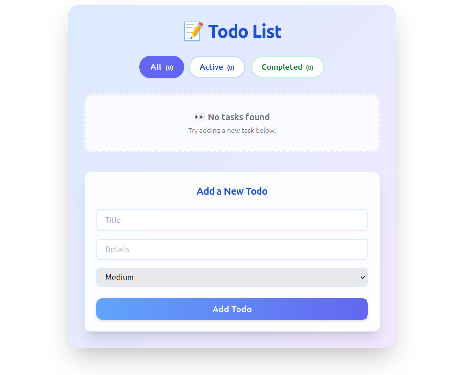

# React Tailwind Todo App

A clean, modern Todo List app built with React, Tailwind CSS, and Vite. It features priority sorting, persistent storage, and a simple, beautiful UI.

---

## Features

- Add, edit, delete todos
- Mark todos as completed/uncompleted
- Set priority (High, Medium, Low) with color badges
- Sort by priority and creation date automatically
- View details and status in a dialog
- All data saved in localStorage

---

## Folder Structure

```
src/
	components/   # Todo, TodoList, Dialog, Form
	context/      # TodoProvider, TodoContext
	hooks/        # useTodos custom hook
	App.jsx       # App root
	main.jsx      # Entry point
```

---

## How it Works

- **State Management:**

  - Uses React Context (`TodoProvider`) and `useReducer` for todos.
  - All actions (add, edit, delete, toggle) are dispatched to the reducer.
  - State is synced to localStorage automatically.

- **Adding Todos:**

  - Use the form to add a todo with title, details, and priority.
  - Each todo gets a timestamp and is shown instantly.

- **Sorting:**

  - Todos are always sorted: High > Medium > Low priority, then newest first.

- **UI Components:**

  - `TodoList`: Shows todos, filter buttons, and handles dialog state.
  - `Todo`: Shows a single todo with colored priority badge and action buttons.
  - `Dialog`: Modal for editing, deleting, or viewing a todo.
  - `Form`: Add new todos.

- **Styling:**
  - All UI uses Tailwind CSS for a modern, responsive look.

---

## Usage

1. **Install dependencies:**
   ```bash
   npm install
   ```
2. **Run the app:**
   ```bash
   npm run dev
   ```
3. Open [http://localhost:5173](http://localhost:5173)

---

## Example Screenshot



---

## Code Overview

- **TodoProvider.jsx**: Sets up the reducer, context, and localStorage sync.
- **TodoList.jsx**: Filters and sorts todos, manages dialog state, renders the list.
- **Todo.jsx**: Renders a todo card, shows priority badge, and action buttons.
- **Dialog.jsx**: Modal for editing, deleting, or viewing a todo.
- **Form.jsx**: Controlled form for adding todos.
- **useTodos.js**: Custom hook to access todos and dispatch from context.

---

## Customization

- Change colors or layout by editing Tailwind classes in components.
- Add more fields (like due date) by extending the form and reducer.
- Connect to a backend by replacing localStorage logic in the provider.
